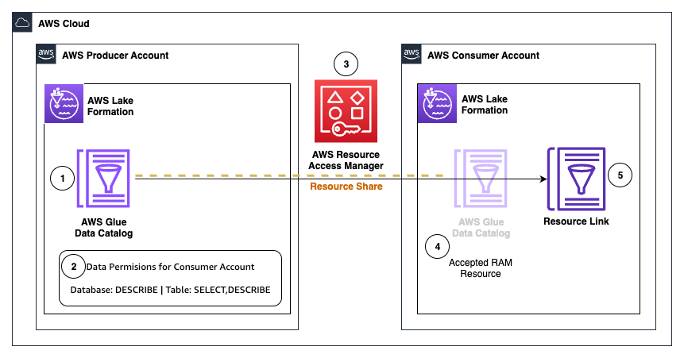

# Cross Account Catalog Sharing

This pattern provide terraform modules for cross account data catalog sharing using lakeformation.
One for producer account and one for consumer account.
To implement this pattern one need to have good understanding of Terraform.

## Architecture

    

1. AWS Producer account has a data catalog which need to be shared with AWS Consumer Account.

2. Data permissions are granted to the producer account data catalog from lakeformation (using producer pattern - [Producer Permissions Granted to Consumers](./producer/DSH-PRODUCER/lakeformation.tf)).

3. Those permissions uses AWS Resource Access Manager (RAM) to share the catalog.

4. In Consumer account we accept that RAM resource (using consumer pattern - [Consumer RAM Accept](./consumer/DSH-CONSUMER/assets/ram_accept.sh))

5. After accepting the RAM resource we create a Resource Link for that catalog (using consumer pattern - [Consumer Resource Link Creation](./consumer/DSH-CONSUMER/consumer.tf)).

## How to use these modules

- To use these modules follow individual module readme - [Producer](./producer/DSH-PRODUCER/_README.md) and [Consumer](./consumer/DSH-CONSUMER/README.md)

## Security

See [CONTRIBUTING](CONTRIBUTING.md#security-issue-notifications) for more information.

## License

This library is licensed under the MIT-0 License. See the LICENSE file.
